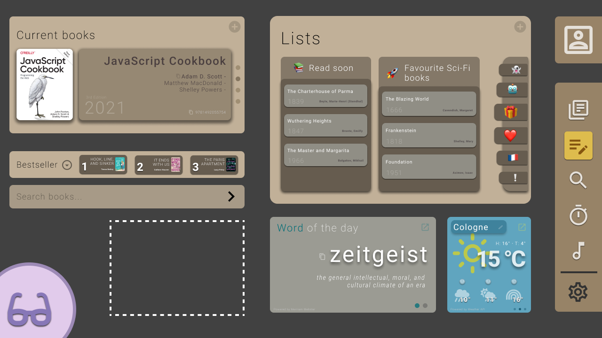
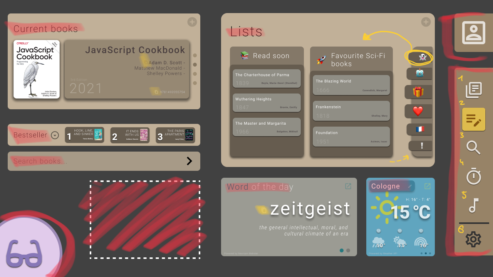

# Reading Helper

## Idea behind

While reading a book, I use many applications, e.g.
search engine for general information on authors, historical context etc.
dictionary or synonym finder to explain unknown words
notebook to set down thoughts or text passages
summarise certain chapters or author’s points

Therefore, I use my browser and sometimes desktop application parallelly to reading. Sometimes, it ends in a hectic and convoluted jumping back and forth – between tabs and applications.

_Draft for the final version of the Reading Helper_

Since I do like printed books then digital ones and I do not want to miss the handy features e-book reader like Apple Books have, I want a handy little helper who provides with just the tools I need during my reading session – and maybe a touch of further input that inspire the bookworm part inside me (e.g. recommended books, bestseller list, the presentation of the “author of the day”, or just a quote of a famous authors).

In a nutshell, I want to build **a place you aim for when you open the pages of your printed books**. This place shall support your reading experience. It should never get in the way between you and the magical world of written words.

## Features' descriptions

_Marked version of the draft for explanation_

A quick explanation of every feature visible on the draft of the Reading Helper's final version:

### Current books

- possibility to keep track of your current read books
- adding works by keying in a book title, while the Google Books API provides the remaining information
- yellow marking emphasises the copy icon which enables to copy text directly to the clipboard which works throughout the whole application at different spots (e.g. copying the word of the day to your clipboard)

### Bestseller

- quick glance at a bestseller list
- default: New York Times Best selling books (powered by their API)

### Search books

- search for a book in the Google Books database
- a pop-up frame with the search results will appear in the area hemmed by the white-dotted border

## Hemmed area with the white-dotted border

- place for update notifications (or any other notifications)
  and a place for the SERP of the books search

## Lists

- simple lists for books
- every list name should contain an emoji (like in the creation of Notion pages)
- extended view for up to two lists
- the remaining lists are collected in the bar on the right side of the Lists box
- while being in the bar on the right side, only the lists' emoji will be seen due to save space and sustain an ordered view
- lists can be switched between the extended view and the “misc bar” by Drag and Drop

## Word (/quote) of the day

- an API (e.g. Merriam-Webster) provides a word along with its definition
- by turning the mouse wheel, you can between Word and Quote of the Day
  the Quote of the Day will also be provided by an API

## Weather report

- simple report for several cities
- turn mouse wheel to jump between cities
- forecast will be display for every second upcoming hour
  powered by some API

## Button on the bottom-left side or “Focus mode”

- opens a distraction-reduced page
- clean and simple style
- only a few features are available (e.g. word search and/or music player, some background picture)
- customisable
- inspiration: Momentum Dash’s new tab page

## Account

- user will be able to create accounts and save the data on a server
  place for the configuration of account’s settings

## Sidebar or “Feature bar”

### Library view

- creates a skeuomorphic view on a books list (like the bookshelf of the Apple’s pre-iOS 7 Books app)
- more or less useless but embellished way to have a glance at your books digitally

### Notes

- opens the application’s note sub-app
- simple note taking à la Google Keep (in the beginning)
  long term goal: a place for summaries and more detailed notes (à la Notion)

### Word search

- similar to the book search
- difference: searching for words
- providing definitions and synonyms

### Timer

- basically a simple timer
- additional features for keeping a record of your reading time
- maybe: share them indirectly with friend à la Apple’s Fitness app

### Music player

- provides ambiance music for reading
- not sure how to feed this feature yet (maybe there is a Spotify API)

### Settings

- place for configuration of the app
